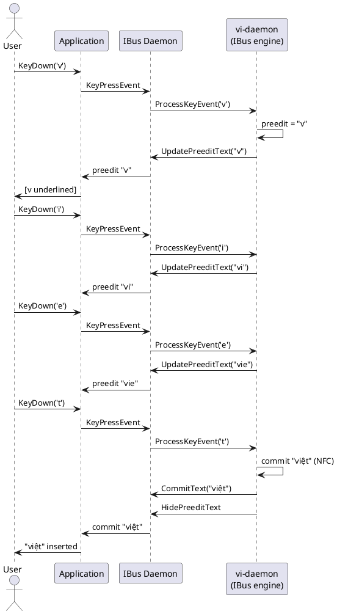

# IBus and Fcitx5 Integration

## Normal typing flow

> **IBus rendering**: vhttechkey attaches `IBUS_ATTR_TYPE_NONE` attributes (no-underline mode),
> so Gtk/Qt usually draw **no** composition underline even though Chromium may still
> decorate inline preedit differently.

If **VS Code or another Electron app** loses the whole word right after commit while
**Chrome or Telegram** behave normally, update to a vime build that emits
**`CommitText` before `HidePreeditText`** on IBus (vhttechkey commit order).
If the problem persists, it is usually a **different IME surface** (Wayland vs
XWayland, Qt vs Electron), not the NFC commit step in the diagram below — see the
**Electron (VS Code, …)** section in [docs/troubleshooting.md](troubleshooting.md).

The sequence below shows what happens when the user types `"viet"` using the
Telex input method.  The preedit accumulates until the syllable is complete,
then commits `"việt"` in NFC.

### IBus

```
User          Application       IBus Daemon        vi-daemon (IBus engine)
 │                │                  │                        │
 │  KeyDown('v')  │                  │                        │
 ├───────────────►│                  │                        │
 │                │   KeyPressEvent  │                        │
 │                ├─────────────────►│                        │
 │                │                  │    ProcessKeyEvent     │
 │                │                  ├───────────────────────►│
 │                │                  │                        │ Engine: 'v' → preedit "v"
 │                │                  │  UpdatePreeditText     │
 │                │                  │◄───────────────────────┤
 │                │  preedit "v"     │                        │
 │                │◄─────────────────┤                        │
 │  [v underlined]│                  │                        │
 │◄───────────────┤                  │                        │
 │                │                  │                        │
 │  KeyDown('i')  │                  │                        │
 ├───────────────►│  KeyPressEvent  ├───────────────────────►│
 │                │                  │                        │ preedit "vi"
 │                │◄─── preedit "vi"─┤                        │
 │                │                  │                        │
 │  KeyDown('e')  ├─────────────────►├───────────────────────►│
 │                │◄─── preedit "vie"┤                        │
 │                │                  │                        │
 │  KeyDown('t')  ├─────────────────►├───────────────────────►│
 │                │                  │                        │ Syllable complete:
 │                │                  │                        │ commit "việt" (NFC U+1EC7)
 │                │                  │    CommitText("việt")  │
 │                │                  │◄───────────────────────┤
 │                │                  │    HidePreeditText     │
 │                │                  │◄───────────────────────┤
 │                │  commit "việt"   │                        │
 │                │◄─────────────────┤                        │
 │  "việt" in doc │                  │                        │
 │◄───────────────┤                  │                        │
```

### Fcitx5

```
User          Application      Fcitx5 Daemon       vi-daemon (Fcitx5 addon)
 │                │                  │                        │
 │  KeyDown('v')  │                  │                        │
 ├───────────────►│   KeyEvent (DBus)│                        │
 │                ├─────────────────►│  ProcessKey (addon API)│
 │                │                  ├───────────────────────►│
 │                │                  │                        │ preedit "v"
 │                │                  │  UpdateClientSideUI    │
 │                │                  │◄───────────────────────┤
 │                │  InputContext    │                        │
 │                │◄ updateFormattedPreedit                   │
 │  [v underlined]│                  │                        │
 │◄───────────────┤                  │                        │
 │                │       … (i, e) …                         │
 │  KeyDown('t')  ├─────────────────►├───────────────────────►│
 │                │                  │                        │ commit "việt"
 │                │                  │  CommitString("việt")  │
 │                │                  │◄───────────────────────┤
 │                │  commitString    │                        │
 │                │◄─────────────────┤                        │
 │  "việt" in doc │                  │                        │
```

## Focus switch during composition

If the user clicks another window while `"vie"` is in preedit:

```
User          App A           IBus / Fcitx5       vi-daemon
 │                │                  │                 │
 │  [click App B] │                  │                 │
 │                │  FocusOut        │                 │
 │                ├─────────────────►│  FocusOut       │
 │                │                  ├────────────────►│
 │                │                  │                 │ Reset preedit;
 │                │                  │                 │ commit partial "vie" as-is
 │                │                  │  CommitText     │
 │                │                  │◄────────────────┤
 │                │◄─ commit "vie"───┤                 │
 │                │                  │  FocusIn (App B)│
 │        App B   │                  ├────────────────►│
 │                │                  │                 │ Fresh state for App B
```

> **Policy**: on `FocusOut` vime commits any in-progress preedit as raw ASCII
> rather than discarding it, to avoid silently losing keystrokes.

## Daemon restart recovery

If vi-daemon crashes or is restarted while typing:

```
App           IBus / Fcitx5       vi-daemon (old)    vi-daemon (new)
 │                  │                    │                  │
 │                  │    [crash / SIGTERM]│                  │
 │                  │                    ✕                  │
 │                  │                                       │
 │                  │  [watchdog restarts daemon]           │
 │                  │                                       │ Bind socket
 │                  │                                       │ Re-register engine
 │  KeyDown('a')    │                                       │
 ├─────────────────►│  ProcessKeyEvent                      │
 │                  ├──────────────────────────────────────►│
 │                  │                                       │ Fresh state;
 │                  │                                       │ 'a' → preedit "a"
 │                  │◄──────────── UpdatePreeditText("a") ──┤
 │◄─────────────────┤                                       │
```

The `watchdog.rs` module in vi-daemon monitors the engine subprocess and
restarts it within 500 ms.  The IME framework (IBus / Fcitx5) is unaware of
the restart; it sees only a brief gap in `ProcessKeyEvent` responses.

## PlantUML source

The diagrams above can be rendered with PlantUML for visual presentation.
Save the following as `ibus-normal.puml`:


