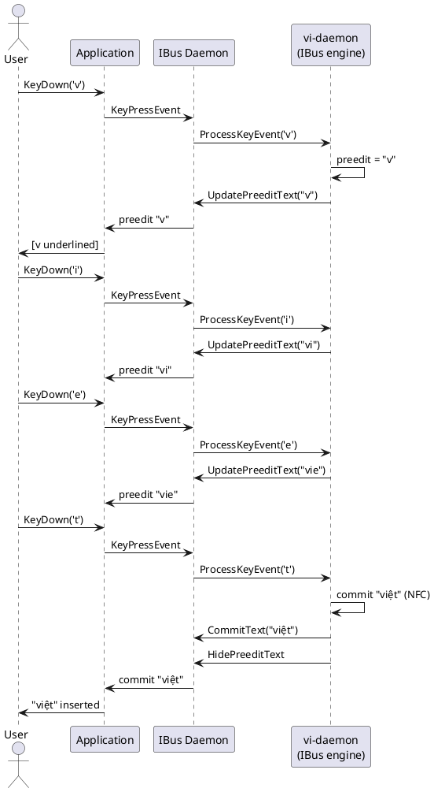

# Tích hợp IBus và Fcitx5

## Luồng gõ bình thường

> **Hiển thị IBus**: VHTTechKey gắn thuộc tính `IBUS_ATTR_TYPE_NONE` (chế độ không gạch chân),
> nên Gtk/Qt thường **không** vẽ gạch chân composition dù Chromium vẫn có thể
> trang trí preedit inline khác.

Nếu **VS Code hoặc app Electron khác** mất cả từ ngay sau commit trong khi
**Chrome hoặc Telegram** vẫn bình thường, hãy cập nhật bản VHTTechKey phát
**`CommitText` trước `HidePreeditText`** trên IBus (thứ tự commit của VHTTechKey).
Nếu vẫn lỗi, thường do **bề mặt IME khác nhau** (Wayland vs XWayland, Qt vs Electron),
không phải bước commit NFC trong sơ đồ dưới — xem mục
**Electron (VS Code, …)** trong [docs/troubleshooting.md](troubleshooting.md).

Sơ đồ dưới cho thấy điều gì xảy ra khi người dùng gõ `"viet"` bằng kiểu Telex.
Preedit tích lũy đến khi âm tiết hoàn chỉnh, rồi commit `"việt"` ở dạng NFC.

### IBus

```
User          Application       IBus Daemon        vi-daemon (IBus engine)
 │                │                  │                        │
 │  KeyDown('v')  │                  │                        │
 ├───────────────►│                  │                        │
 │                │   KeyPressEvent  │                        │
 │                ├─────────────────►│                        │
 │                │                  │    ProcessKeyEvent     │
 │                │                  ├───────────────────────►│
 │                │                  │                        │ Engine: 'v' → preedit "v"
 │                │                  │  UpdatePreeditText     │
 │                │                  │◄───────────────────────┤
 │                │  preedit "v"     │                        │
 │                │◄─────────────────┤                        │
 │  [v underlined]│                  │                        │
 │◄───────────────┤                  │                        │
 │                │                  │                        │
 │  KeyDown('i')  │                  │                        │
 ├───────────────►│  KeyPressEvent  ├───────────────────────►│
 │                │                  │                        │ preedit "vi"
 │                │◄─── preedit "vi"─┤                        │
 │                │                  │                        │
 │  KeyDown('e')  ├─────────────────►├───────────────────────►│
 │                │◄─── preedit "vie"┤                        │
 │                │                  │                        │
 │  KeyDown('t')  ├─────────────────►├───────────────────────►│
 │                │                  │                        │ Syllable complete:
 │                │                  │                        │ commit "việt" (NFC U+1EC7)
 │                │                  │    CommitText("việt")  │
 │                │                  │◄───────────────────────┤
 │                │                  │    HidePreeditText     │
 │                │                  │◄───────────────────────┤
 │                │  commit "việt"   │                        │
 │                │◄─────────────────┤                        │
 │  "việt" in doc │                  │                        │
 │◄───────────────┤                  │                        │
```

### Fcitx5

```
User          Application      Fcitx5 Daemon       vi-daemon (Fcitx5 addon)
 │                │                  │                        │
 │  KeyDown('v')  │                  │                        │
 ├───────────────►│   KeyEvent (DBus)│                        │
 │                ├─────────────────►│  ProcessKey (addon API)│
 │                │                  ├───────────────────────►│
 │                │                  │                        │ preedit "v"
 │                │                  │  UpdateClientSideUI    │
 │                │                  │◄───────────────────────┤
 │                │  InputContext    │                        │
 │                │◄ updateFormattedPreedit                   │
 │  [v underlined]│                  │                        │
 │◄───────────────┤                  │                        │
 │                │       … (i, e) …                         │
 │  KeyDown('t')  ├─────────────────►├───────────────────────►│
 │                │                  │                        │ commit "việt"
 │                │                  │  CommitString("việt")  │
 │                │                  │◄───────────────────────┤
 │                │  commitString    │                        │
 │                │◄─────────────────┤                        │
 │  "việt" in doc │                  │                        │
```

## Chuyển focus khi đang soạn

Nếu người dùng bấm cửa sổ khác khi preedit còn `"vie"`:

```
User          App A           IBus / Fcitx5       vi-daemon
 │                │                  │                 │
 │  [click App B] │                  │                 │
 │                │  FocusOut        │                 │
 │                ├─────────────────►│  FocusOut       │
 │                │                  ├────────────────►│
 │                │                  │                 │ Reset preedit;
 │                │                  │                 │ commit partial "vie" as-is
 │                │                  │  CommitText     │
 │                │                  │◄────────────────┤
 │                │◄─ commit "vie"───┤                 │
 │                │                  │  FocusIn (App B)│
 │        App B   │                  ├────────────────►│
 │                │                  │                 │ Fresh state for App B
```

> **Chính sách**: khi `FocusOut`, VHTTechKey commit mọi preedit đang soạn dưới dạng ASCII thô
> thay vì bỏ im, để tránh mất phím im lặng.

## Phục hồi sau khởi động lại daemon

Nếu vi-daemon crash hoặc được khởi động lại khi đang gõ:

```
App           IBus / Fcitx5       vi-daemon (old)    vi-daemon (new)
 │                  │                    │                  │
 │                  │    [crash / SIGTERM]│                  │
 │                  │                    ✕                  │
 │                  │                                       │
 │                  │  [watchdog restarts daemon]           │
 │                  │                                       │ Bind socket
 │                  │                                       │ Re-register engine
 │  KeyDown('a')    │                                       │
 ├─────────────────►│  ProcessKeyEvent                      │
 │                  ├──────────────────────────────────────►│
 │                  │                                       │ Fresh state;
 │                  │                                       │ 'a' → preedit "a"
 │                  │◄──────────── UpdatePreeditText("a") ──┤
 │◄─────────────────┤                                       │
```

Module `watchdog.rs` trong vi-daemon giám sát subprocess engine và
khởi động lại trong vòng 500 ms. Framework IME (IBus / Fcitx5) không biết
việc restart; chỉ thấy khoảng trống ngắn trong phản hồi `ProcessKeyEvent`.

## Nguồn PlantUML

Các sơ đồ trên có thể render bằng PlantUML để trình bày trực quan.
Lưu nội dung sau thành `ibus-normal.puml`:


