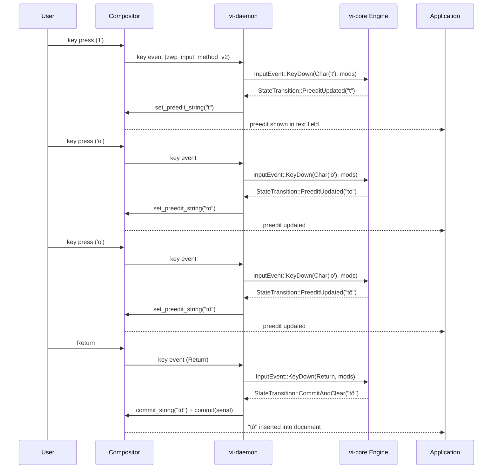
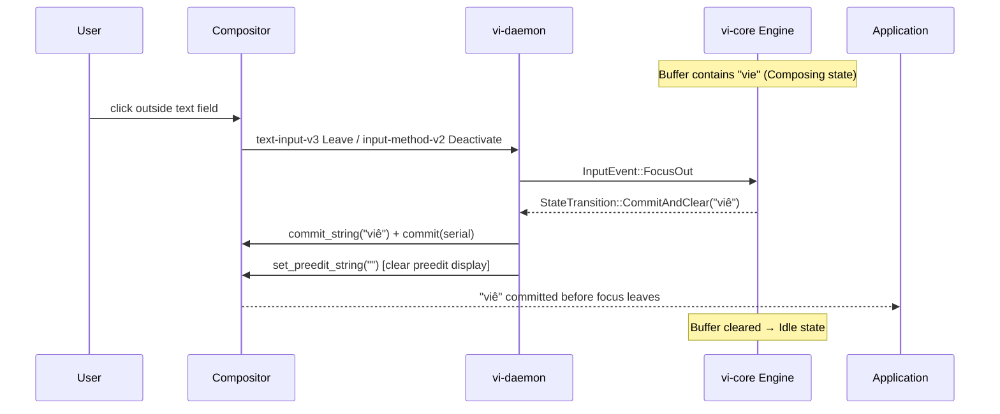
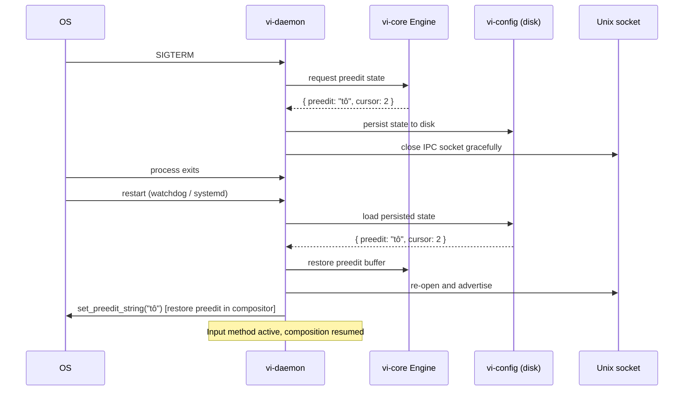
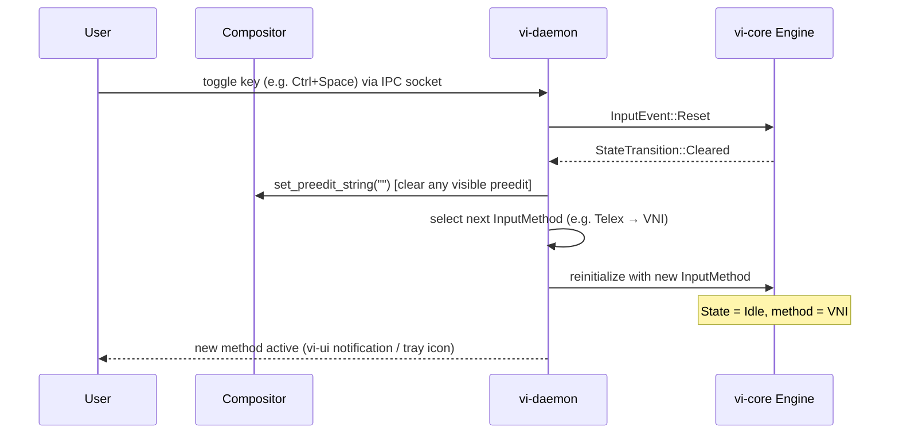

# Sequence Diagrams

## 1. Normal typing flow

Key events travel from the compositor to `vi-daemon`, through the `vi-core`
engine, back as preedit updates, and finally as a commit to the application.

## 2. Focus-out commit

When the user switches focus away, `vi-daemon` receives a `FocusOut` event and
auto-commits any pending preedit so the text is not lost.

## 3. Daemon restart recovery

`vi-daemon` serializes the in-progress preedit buffer before shutting down so
the composition can be restored after a restart.

## 4. Input method switching

The user toggles the active input method via a key binding. `vi-daemon` receives
the request over IPC, resets the engine, and loads the new method.

