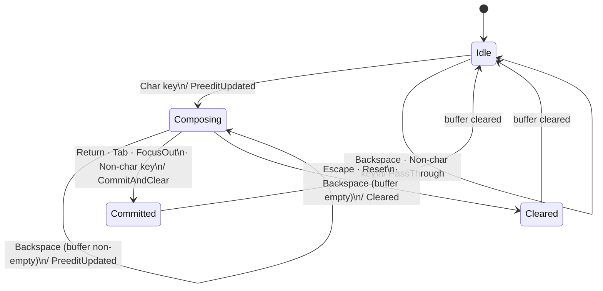

# Máy trạng thái CompositionEngine

`StandardEngine` trong `vi-core` là máy trạng thái thuần với bốn trạng thái logic.
Mọi chuyển trạng thái do `InputEvent` kích hoạt và sinh ra `StateTransition`.

## Trạng thái

| Trạng thái | Mô tả | Điều kiện buffer |
|---|---|---|
| **Idle** | Không có composition đang diễn ra | Rỗng |
| **Composing** | Preedit hiển thị cho người dùng | Không rỗng |
| **Committed** | Văn bản đã ghép được commit vào ứng dụng | Rỗng (vừa xóa) |
| **Cleared** | Composition bị bỏ mà không commit | Rỗng (vừa xóa) |

Cả `Committed` và `Cleared` đều nhất thời: buffer rỗng khi đạt tới,
nên sự kiện kế tiếp được xử lý từ `Idle`.

## Chuyển trạng thái

| Từ | Sự kiện | Điều kiện | `StateTransition` phát ra | Tới |
|---|---|---|---|---|
| Idle | `Char key` | — | `PreeditUpdated(text)` | Composing |
| Idle | `Backspace` | buffer rỗng | `PassThrough` | Idle |
| Idle | Non-char key | buffer rỗng | `PassThrough` | Idle |
| Composing | `Char key` | — | `PreeditUpdated(text)` | Composing |
| Composing | `Backspace` | buffer không rỗng sau rollback | `PreeditUpdated(text)` | Composing |
| Composing | `Backspace` | buffer rỗng sau rollback | `Cleared` | Cleared |
| Composing | `Return` / `Tab` | — | `CommitAndClear(text)` | Committed |
| Composing | `Escape` | — | `Cleared` | Cleared |
| Composing | `Reset` event | — | `Cleared` | Cleared |
| Composing | `FocusOut` | — | `CommitAndClear(text)` | Committed |
| Composing | Non-char key | buffer không rỗng | `CommitAndClear(text)` | Committed |
| Any | `KeyUp` | — | `Consumed` | *(không đổi)* |
| Any | `FocusIn` | — | `Consumed` | *(không đổi)* |

> Nguồn: `crates/vi-core/src/engine.rs` — `StandardEngine::process`.
