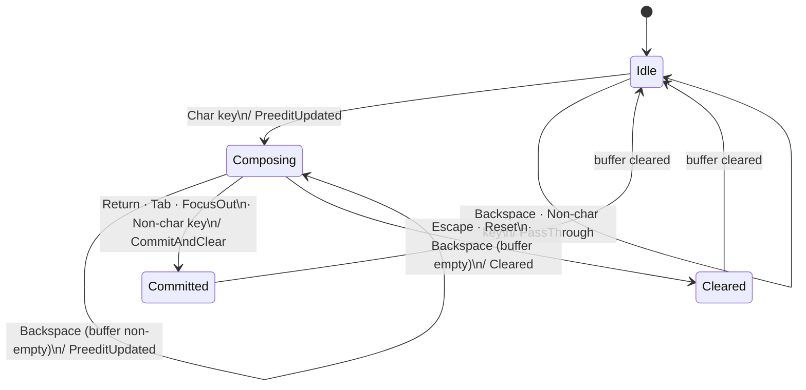

# CompositionEngine State Machine

The `StandardEngine` in `vi-core` is a pure state machine with four logical states.
All transitions are driven by `InputEvent`s and produce a `StateTransition`.

## States

| State | Description | Buffer condition |
|---|---|---|
| **Idle** | No composition in progress | Empty |
| **Composing** | Preedit text is displayed to the user | Non-empty |
| **Committed** | Composed text has been committed to the application | Empty (just cleared) |
| **Cleared** | Composition was discarded without committing | Empty (just cleared) |

Both `Committed` and `Cleared` are transient: the buffer is empty when they are
reached, so the next event is processed from `Idle`.

## Transitions

| From | Event | Guard | `StateTransition` emitted | To |
|---|---|---|---|---|
| Idle | `Char key` | — | `PreeditUpdated(text)` | Composing |
| Idle | `Backspace` | buffer empty | `PassThrough` | Idle |
| Idle | Non-char key | buffer empty | `PassThrough` | Idle |
| Composing | `Char key` | — | `PreeditUpdated(text)` | Composing |
| Composing | `Backspace` | buffer non-empty after rollback | `PreeditUpdated(text)` | Composing |
| Composing | `Backspace` | buffer empty after rollback | `Cleared` | Cleared |
| Composing | `Return` / `Tab` | — | `CommitAndClear(text)` | Committed |
| Composing | `Escape` | — | `Cleared` | Cleared |
| Composing | `Reset` event | — | `Cleared` | Cleared |
| Composing | `FocusOut` | — | `CommitAndClear(text)` | Committed |
| Composing | Non-char key | buffer non-empty | `CommitAndClear(text)` | Committed |
| Any | `KeyUp` | — | `Consumed` | *(unchanged)* |
| Any | `FocusIn` | — | `Consumed` | *(unchanged)* |

> Source: `crates/vi-core/src/engine.rs` — `StandardEngine::process`.
